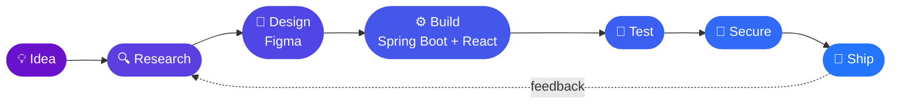

<!-- ═══════════════════════════ HEADER ═══════════════════════════ -->
<p align="center">
  
</p>

<p align="center">
  <a href="https://git.io/typing-svg">
    
  </a>
</p>

<!-- ═══════════════════════════ QUICK BADGES ═══════════════════════════ -->
<p align="center">
  
  <a href="https://github.com/nimeshhasaranga?tab=followers"></a>
  
</p>

<p align="center">
  <a href="mailto:nimeshhasaranga02@gmail.com"></a>
  <a href="https://linkedin.com/in/nimesh-hasaranga" target="_blank"></a>
  <a href="https://github.com/nimeshhasaranga" target="_blank"></a>
  <a href="https://instagram.com/_nimesh_hasaranga" target="_blank"></a>
</p>

<!-- ═══════════════════════════ NAV BAR ═══════════════════════════ -->
<p align="center">
  <a href="#-about-me"></a>
  <a href="#-featured-projects"></a>
  <a href="#-tech-arsenal"></a>
  <a href="#-github-analytics"></a>
  <a href="#-my-journey"></a>
</p>

<p align="center">
  
</p>

<!-- ═══════════════════════════ ABOUT ME ═══════════════════════════ -->
## 🧑‍💻 About Me

<table>
<tr>
<td width="55%" valign="top">

```java
public class Nimesh {

    String role       = "Full-Stack Developer";
    String education  = "BSc (Hons) Software Engineering @ SLIIT";
    String location   = "Sri Lanka 🇱🇰";

    String[] backend  = {"Java", "Spring Boot", "Node.js", "Express"};
    String[] frontend = {"React", "TypeScript", "Tailwind CSS"};
    String[] mobile   = {"Android", "Kotlin"};
    String[] data     = {"MySQL", "PostgreSQL", "MongoDB"};

    String research   = "Pair Path — ML-driven pair programming support";
    String funFact    = "Power naps ➝ power commits 🚀";

    boolean openToWork() { return true; }
}
```

</td>
<td width="45%" valign="top" align="center">


</td>
</tr>
</table>

<!-- ═══════════════════════════ CURRENTLY ═══════════════════════════ -->
## ⚡ Right Now

<table align="center">
<tr>
<td align="center" width="25%">🔬<br><b>Researching</b><br><sub>Pair Path — real-time pair programming support for Java beginners</sub></td>
<td align="center" width="25%">🏗️<br><b>Building</b><br><sub>Hotel Management System</sub></td>
<td align="center" width="25%">🧱<br><b>Exploring</b><br><sub>Clean Architecture</sub></td>
<td align="center" width="25%">🎨<br><b>Practicing</b><br><sub>Design Systems</sub></td>
</tr>
</table>

<!-- ═══════════════════════════ PROJECTS ═══════════════════════════ -->
## 🚀 Featured Projects

<table>
<tr>
<td width="50%" valign="top">

### 🤝 Pair Path
<sub>Final-year research · R26-SE-036</sub>

Real-time collaborative pair programming support for beginner Java learners, driven by an ML model.


[](https://github.com/nimeshhasaranga/REPO_NAME)

</td>
<td width="50%" valign="top">

### 🏨 Hotel Management System
<sub>Full-stack web application</sub>

Bookings, rooms and guest management with secure authentication and a responsive dashboard.


[](https://github.com/nimeshhasaranga/REPO_NAME)

</td>
</tr>
<tr>
<td width="50%" valign="top">

### 🍛 Traditional Kitchen
<sub>HCI group project · Team lead</sub>

Mobile app concept preserving traditional Sri Lankan culinary knowledge — user research through to a high-fidelity Figma prototype.


[](https://www.figma.com/)

</td>
<td width="50%" valign="top">

### 🔐 Secure App Hardening
<sub>Security engineering · Group project</sub>

Vulnerability remediation and OAuth 2.0 / OpenID Connect integration for an existing web application.


[](https://github.com/nimeshhasaranga/REPO_NAME)

</td>
</tr>
</table>

<!-- ═══════════════════════════ TECH STACK ═══════════════════════════ -->
## 🛠️ Tech Arsenal

<table align="center">
<tr><td align="center"><b>💻 Languages</b></td><td></td></tr>
<tr><td align="center"><b>⚙️ Backend</b></td><td></td></tr>
<tr><td align="center"><b>🎨 Frontend</b></td><td></td></tr>
<tr><td align="center"><b>📱 Mobile</b></td><td></td></tr>
<tr><td align="center"><b>🗄️ Databases</b></td><td></td></tr>
<tr><td align="center"><b>🧰 Tools</b></td><td></td></tr>
</table>

<details>
  <summary><b>📊 Skill Levels (click to expand)</b></summary>
<br>

| Skill | Level |
|:--|:--|
| ☕ Java / Spring Boot |  |
| ⚛️ React |  |
| 🗄️ SQL Databases |  |
| 🐍 Python / ML |  |
| 📱 Android / Kotlin |  |
| 🎨 UI/UX (Figma) |  |

</details>

<details>
  <summary><b>🧱 Backend & Databases</b></summary>

  - Java • Spring Boot (REST, Security, JPA)
  - Node.js • Express
  - SQL (MySQL, PostgreSQL) • NoSQL (MongoDB)
  - Auth (JWT, OAuth 2.0 / OIDC) • Caching • Pagination
</details>

<details>
  <summary><b>🎨 Frontend & Mobile</b></summary>

  - React (Hooks, Context, patterns)
  - Tailwind CSS • Accessibility • Animations
  - Android (Kotlin/Java) • XML UI
</details>

<details>
  <summary><b>🤖 Machine Learning</b></summary>

  - Python • scikit-learn • XGBoost
  - Feature engineering • Model evaluation (Accuracy, Macro F1)
</details>

<!-- ═══════════════════════════ WORKFLOW (Mermaid) ═══════════════════════════ -->
## 🔄 How I Build



<!-- ═══════════════════════════ STATS ═══════════════════════════ -->
## 📈 GitHub Analytics

<p align="center">
  
  
</p>

<p align="center">
  
</p>

<p align="center">
  
</p>

<h3 align="center">🏆 Trophies</h3>
<p align="center">
  
</p>

<!-- ═══════════════════════════ SNAKE ═══════════════════════════ -->
<h3 align="center">🐍 Contributions in Motion</h3>
<p align="center">
  <picture>
    <source media="(prefers-color-scheme: dark)" srcset="https://raw.githubusercontent.com/nimeshhasaranga/nimeshhasaranga/output/github-contribution-grid-snake-dark.svg">
    
  </picture>
</p>

<!-- ═══════════════════════════ JOURNEY ═══════════════════════════ -->
## 🧭 My Journey

<table>
<tr><td>🎓</td><td><b>BSc (Hons) Software Engineering</b> — SLIIT</td><td></td></tr>
<tr><td>🔬</td><td><b>Research:</b> Pair Path — ML-driven pair programming support</td><td></td></tr>
<tr><td>🔐</td><td><b>Security Engineering:</b> OAuth/OIDC, cryptography labs</td><td></td></tr>
<tr><td>🎨</td><td><b>HCI:</b> Led a team building a cultural recipe app prototype</td><td></td></tr>
</table>

<!-- ═══════════════════════════ QUOTE ═══════════════════════════ -->
<p align="center">
  
</p>

<!-- ═══════════════════════════ CTA ═══════════════════════════ -->
<h3 align="center">🤝 Let's build something great together</h3>
<p align="center">
  <a href="mailto:nimeshhasaranga02@gmail.com">
    
  </a>
  <a href="https://linkedin.com/in/nimesh-hasaranga">
    
  </a>
</p>

<p align="center">
  
</p>
